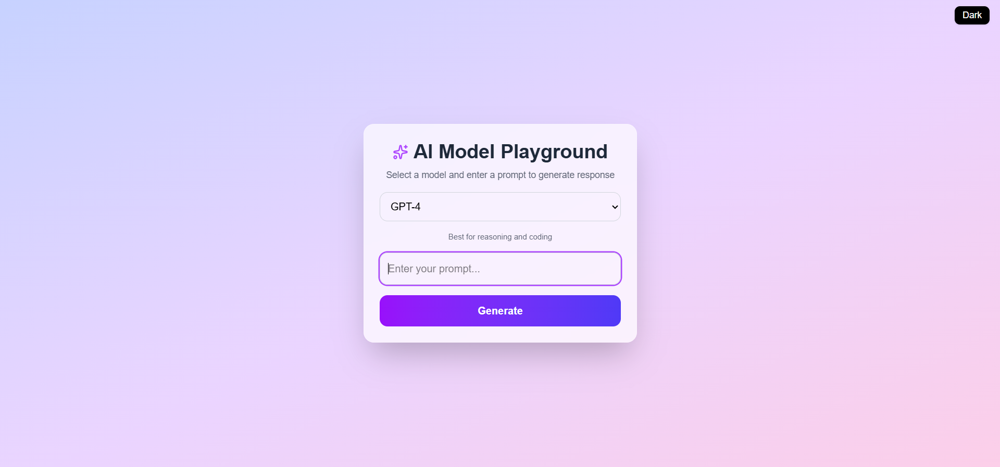

# AI Model Playground (GSoC PoC)

> A clean and user-friendly interface for experimenting with AI model interactions.

## Preview 

## Overview
This project is a Proof of Concept (PoC) for improving AI model handling and user experience in API Dash.

## Features
- Model selection with proper fallback handling
- Input validation and user-friendly error messages
- Loading indicators for async operations
- Clean and responsive UI
- Improved user feedback system

## Tech Stack
- Next.js
- React
- Tailwind CSS

## Demo
This project simulates an AI workflow including model selection, prompt input, and response generation.

## Purpose
This PoC demonstrates improvements proposed for API Dash, focusing on better UX, error handling, and clarity in AI interactions.

## Live Demo
https://ai-model-playground-zeta.vercel.app/